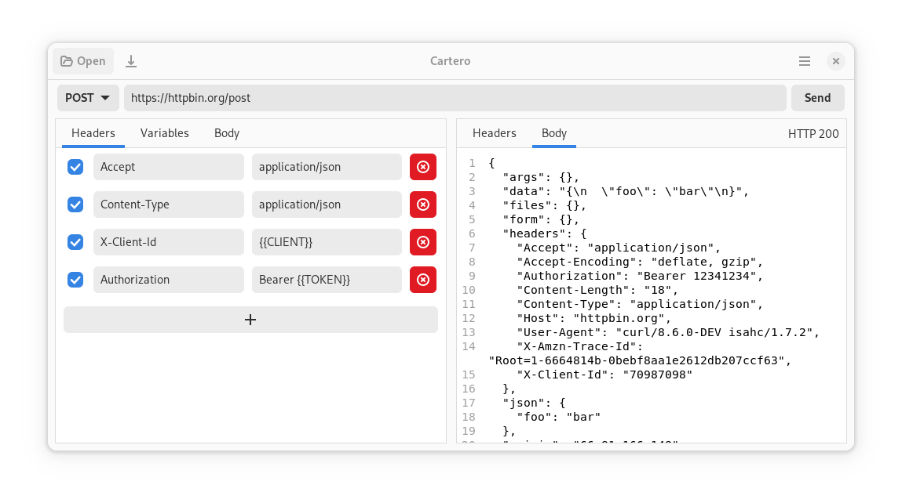

<div style="text-align: center;">


# Cartero
Make HTTP requests and test APIs.
</div>



> 🚧 This is a work in progress and therefore you should expect that the
> application may not have all the features at this moment.

## Motivation

This project exists because there aren't many native graphical HTTP testing
applications / graphical alternatives to cURL that are fully free software, and
I think the world has had enough of Electron / non-native applications that are
anonymously accesible until one day you are forced to create an account and
log in to use.

## Roadmap

v0.1 is the first iteration and development is in progress. **The goal with
version v0.1 is to have a basic user interface to make HTTP requests
graphically**, supporting only the most basic features:

* Make HTTP requests setting the endpoint URL and the HTTP verb to use.
* Configure the payload and the request headers.
* Get the response headers, body, status code, size and duration of a request.

**[Check out the kanban for the progress pending until we reach first iteration](kanban).**

Once the first iteration is reached, more features from the
[cool idea, saved for later][later] list will be implemented.

## How to build

Currently, to build the application you'll have to make sure that the required
libraries are installed on your system.

* glib >= 2.72
* gtk >= 4.6
* gtksourceview >= 5.4
* libadwaita >= 1.1

### Meson

Make sure that you have Meson in your system. For instance,

```sh
sudo apt install meson
sudo dnf install meson
sudo pacman -S meson
```

Then use the following commands to build and install the application

```sh
meson setup build
ninja -C build
ninja -C build install
```

To avoid installing system-wide the application, you can use a prefix:

```sh
meson setup build --prefix=~/.local
ninja -C build
ninja -C build install
```

During development mode, you may also prefer to install into the development
directory. Because the application may depend on files generated by Meson that
are installed into specific locations, this may be a required step if you
suddenly cannot run the application due to missing schemas or resources.

```sh
meson setup build --prefix=install
ninja -C build
ninja -C build install
install/bin/cartero
```

**If you plan on contributing to the project**, use the development profile.

```sh
meson setup build -Dprofile=development
```

It will also configure a Git hook so that the source code is checked prior to
authoring a Git commit. The hook runs `cargo fmt` to assert that the code is
formatted. Read `hooks/pre-commit.hook` to inspect what the script does.

### Flatpak

Install the runtime:

```sh
flatpak install --user org.gnome.Sdk//45 org.freedesktop.Sdk.Extension.rust-stable//23.08
```

To build and run the Flatpak:

```sh
flatpak-builder --user flatpak_app build-aux/es.danirod.Cartero.json
flatpak-builder --run flatpak_app build-aux/es.danirod.Cartero.json cartero
```

To install the Flatpak into your system or user Flatpak, use the `--install`
flag and maybe the `--user`:

```sh
flatpak-builder --user --install flatpak_app build-aux/es.danirod.Cartero.json
```

You will find Cartero in your application launcher, or you can launch it with
`flatpak run es.danirod.Cartero`.

## Contributing

> 🐛 This project is currently a larva trying to grow. Do you want to get in?
> Take a seat!

This project is highly appreciative of contributions. If you know about Rust,
GTK or the GNOME technologies and want to help during the development, you can
contribute if you wish. [Fork the project][fork] and commit your code.

Some checklist rules before submitting a pull request:

* **Use a feature branch**, do not make your changes in the trunk branch
  directly.

* **Rebase your code** and make sure that you are working on top of the most
  recent version of the trunk branch, in case something has changed while you
  were working on your code.

* **Update the locales** if you changed strings. The ninja target that you are
  looking for is called `cartero-update-po` (such as `ninja -C build
  cartero-update-po`). Don't worry, you don't have to translate the strings by
  yourself, but make sure that the new templates are added to the .po and .pot
  files.

* **Use the pre-commit hook**. The pre-commit hook will validate that your code
  is formatted. It should be automatically configured if you run Meson in
  development mode (`-Dprofile=development`), but you can install it on your
  own or run `hooks/pre-commit.hook`.

The project is starting small, so if you want to do something big, it is best
to first start a discussion thread with your proposal in order to see how to
make it fit inside the application.

While this application is not official and at the moment is not affiliated with
GNOME, you are expected to follow the [GNOME Code of Conduct][coc] when
interacting with this repository.

## Licenses

Cartero is published under the terms of the GNU General Public License v3.0 or later.

```
Copyright 2024 the Cartero authors

This program is free software: you can redistribute it and/or modify
it under the terms of the GNU General Public License as published by
the Free Software Foundation, either version 3 of the License, or
(at your option) any later version.

This program is distributed in the hope that it will be useful,
but WITHOUT ANY WARRANTY; without even the implied warranty of
MERCHANTABILITY or FITNESS FOR A PARTICULAR PURPOSE.  See the
GNU General Public License for more details.

You should have received a copy of the GNU General Public License
along with this program.  If not, see <https://www.gnu.org/licenses/>.
```
The Cartero icon is published under the a [Creative Commons
Attribution-ShareAlike 4.0 International license][ccbysa].

## Credits and acknowledgments

Cartero is maintained by [Dani Rodríguez][danirod].

Big shoutout to the [contributors][contrib] who have sent patches or
translations!

Also, Christian suggested Cartero as the name for the application and I liked
it enough to call it like so, therefore shoutout to Christian as well!

Finally, shoutout to many of the GTK and GNOME Circle applications out there whose
source code I've read in order to know how to use some of the GTK features that
you cannot learn just by reading the official docs.

## Blog

Dani's [dev blog][blog] (in Spanish) of Cartero.

[ccbysa]: https://creativecommons.org/licenses/by-sa/4.0/
[coc]: https://conduct.gnome.org
[contrib]: https://github.com/danirod/cartero/graphs/contributors
[danirod]: https://github.com/danirod
[fork]: https://github.com/danirod/cartero/fork
[blog]: https://danirod.es/secciones/devlogs/cartero/
[kanban]: https://github.com/users/danirod/projects/9/views/6
[later]: https://github.com/users/danirod/projects/9/views/7