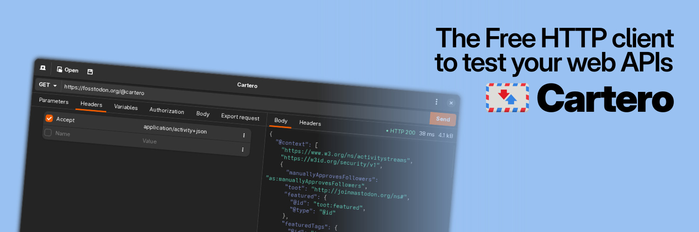

# 🚀 Cartero
### The free HTTP client to test your APIs



---

## 📋 Overview

**Cartero** is a powerful graphical HTTP client designed as a developer tool to test web APIs and perform all kinds of HTTP requests to web servers. It's your perfect companion for REST, SOAP, or XML-RPC API testing, supporting multiple request methods and body payloads.

---

## ✨ Features

- 📁 **Git-friendly storage** - Loads and saves to plain TOML files, so you own your data
- 🔧 **Full customization** - Modify request headers and body payloads with ease  
- 🔐 **Variable binding** - Secure handling of API keys and sensitive information
- 🌐 **Universal compatibility** - Works with any REST, SOAP or XML-RPC API
- 🚀 **Native performance** - Built with Rust and GTK for optimal speed

---

## 💡 Why Cartero?

This project exists because the world needs more **native**, **fully free** HTTP testing applications. We've had enough of:
- ❌ Electron apps that consume excessive resources
- ❌ Tools that suddenly require account creation  
- ❌ Services that force unwanted AI features
- ❌ Applications that prioritize investor metrics over user experience

**Cartero is different** - it's truly free, native, and puts users first.

---

## 📦 Installation

### 🐧 Linux & 🪟 Windows & 🍎 macOS
> **[📥 Download Page](https://cartero.danirod.es/download.html)** | **[🔗 Latest Release](https://github.com/danirod/cartero/releases/latest)**

### 📱 App Stores

<div align="center">

[](https://flathub.org/apps/es.danirod.Cartero)
[](https://snapcraft.io/cartero)

</div>

### 📦 Package Managers

<details>
<summary><strong>🍺 macOS (Homebrew)</strong></summary>

```bash
brew tap SoloAntonio/cartero
brew install --cask cartero
```
</details>

<details>
<summary><strong>🪣 Windows (Scoop)</strong></summary>

```bash
scoop bucket add extras
scoop install extras/cartero
```
</details>

<details>
<summary><strong>❄️ NixOS (Flake)</strong></summary>

Add Cartero to your system [as a flake](https://cartero.danirod.es/docs/installing/nixos-flake.html).
</details>

### 🗂️ Distribution Packages

> **Note:** Community-maintained packages may not always be up-to-date. Please report packaging issues to the respective maintainers first.

[](https://repology.org/project/cartero/versions)

---

## 🛠️ Building from Source

### Prerequisites
- **System Libraries:**
  - `glib >= 2.72`
  - `gtk >= 4.14` 
  - `gtksourceview >= 5.4`
  - `libadwaita >= 1.5`
  - `openssl >= 1.0`

- **Build Tools:** `meson`, `ninja`, `rust`, `gettext`

### Build Commands

```bash
# Standard build
meson setup build
ninja -C build
ninja -C build install
```

```bash
# Custom prefix (recommended)
meson setup build --prefix=/usr
ninja -C build
ninja -C build install
```

---

## 👨‍💻 Development & Contributing

### 🔧 Development Setup

For contributors, use the development profile to enable Git hooks and code formatting:

```bash
meson setup build -Dprofile=development
```

### 📚 Resources

- 📖 **[Hacking Guide](https://cartero.danirod.es/docs/hacking.html)** - Technical documentation
- 🤝 **[Contributing Guide](https://cartero.danirod.es/docs/contributing.html)** - How to contribute
- 🌐 **[Translations](https://hosted.weblate.org/projects/cartero/)** - Help translate via Weblate

### 🚫 AI Policy

**Generative AI usage is prohibited.** We don't accept contributions generated by LLM tools. [Learn more about our policy](https://cartero.danirod.es/docs/contributing.html#use-of-generative-ai).

### 🎯 Ways to Contribute

- 🐛 **Report bugs** and send feedback
- 💬 **Spread the word** about Cartero
- 🌍 **Translate** the application via [Weblate](https://hosted.weblate.org/projects/cartero/)
- 💻 **Submit code** improvements (following our guidelines)

---

## 📜 License

### Code License
**GNU General Public License v3.0 or later**

```
Copyright 2024-2025 the Cartero authors

This program is free software: you can redistribute it and/or modify
it under the terms of the GNU General Public License as published by
the Free Software Foundation, either version 3 of the License, or
(at your option) any later version.

This program is distributed in the hope that it will be useful,
but WITHOUT ANY WARRANTY; without even the implied warranty of
MERCHANTABILITY or FITNESS FOR A PARTICULAR PURPOSE. See the
GNU General Public License for more details.
```

### Icon License
The Cartero icon is licensed under [Creative Commons Attribution-ShareAlike 4.0 International](https://creativecommons.org/licenses/by-sa/4.0/).

---

## 🙏 Credits

**Maintainer:** Dani Rodríguez

**Special Thanks:**
- 🌟 All our amazing [contributors](https://github.com/danirod/cartero/graphs/contributors)
- 💡 Christian for suggesting the "Cartero" name
- 🌍 Translation contributors on Weblate

---

<div align="center">

**Made with ❤️ for developers, by developers**

[🌐 Website](https://cartero.danirod.es) • [📚 Documentation](https://cartero.danirod.es/docs/) • [🐛 Issues](https://github.com/danirod/cartero/issues) • [💬 Discussions](https://github.com/danirod/cartero/discussions)

</div>
