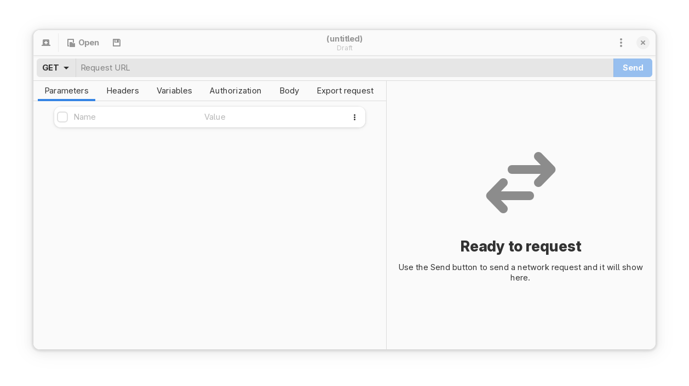
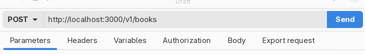
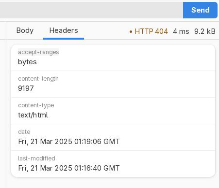

# Basic usage

In this chapter, you'll see how to use Cartero.

## Starting Cartero

When you open Cartero, the previous session is restored. This means that if
you had endpoints opened the last time you closed Cartero, they will open
automatically. If there is no previous session state, you will see the welcome
screen.

To start a new session, you will probably want to create a request. There are many ways to do this:

* Press the _New tab_ button in the welcome message.
* At any time, pressing `Ctrl + T` (`Cmd + T` on macOS).
* Use the _New tab_ button in the application toolbar.
* Choose _New tab_ from the dropdown menu at the top right corner of the window.

You can also open saved requests. Saved requests are files with the .cartero
extension, that can be saved anywhere. They are plain text files, so if you are
working on a project, you could even add them to the version control system
to track changes to the files. To open an existing request you can do so from
one of the multiple ways:

* Press the _Open request_ button in the welcome message.
* At any time, pressing `Ctrl + O` (`Cmd + O` on macOS).
* Use the _Open_ button in the application toolbar.
* Choose _Open request...` from the dropdown menu.

## Your first request

The endpoint panel offers you a form to configure your HTTP request. You can
then send the request using the **Send** button.

To send a request, you will have to at least set the request URL. Use the _Request URL_ entry box to fill the request URL. That will enable the _Send_ button.

However, there are many things you can also configure before submitting the request.

* You can set the HTTP verb with the dropdown that is next to the request URL field.
* You can use the notebook pane that appears below the URL to set the parameters, the headers, the variables, the payload...

## Submit a request

To send a request, press the **Submit** button, or press `Ctrl + Enter` (`Cmd + Enter` on macOS).

Once a response is received, you will see in the response panel information about it.

* The **Headers** tab allows you to explore the headers sent by the server.
* The **Body** tab lets you see the server response. If Cartero detects a known response type such as JSON, XML or HTML, it will apply syntax highlighting automatically.
* Above the tab bar you will see metadata about the request, such as the status code received, the duration and the size of the response.

## Saving a request

To save a request for later, you can do it from one of the following ways:

* Press the **Save** button in the toolbar.
* Press `Ctrl + S` (`Cmd + S` on macOS).
* Choose **Save request** from the dropdown menu in the top right corner of the window.
