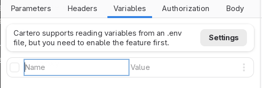
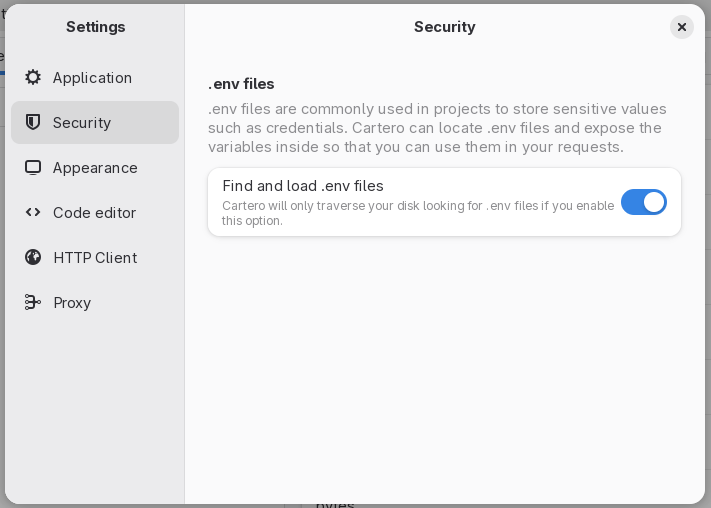
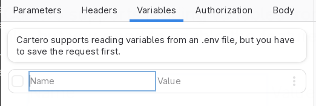
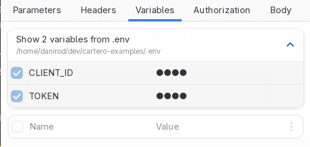

# Using .env files

Cartero supports the use of .env files to provide sensitive variables to an
HTTP request.

## What is an .env file?

An .env file is a file that contains environment variables. Most modern
web frameworks allow the use of .env files to configure sensitive credentials
such as application passwords, API keys, tokens or endpoint roots, instead of
hardcoding these values into the web application code.

This is an example of an .env file:

```
DATABASE_PASSWORD=password
PORT=4321
SEARCH_ENDPOINT=https://search.example.com/v1/search
SEARCH_TOKEN=128347092384709
```

.env files are usually private and not stored in the Git repository of a
project, because they contain sensitive credentials. Usually the development
team will have a safe way to share .env files. Sometimes, developers might
even change or override values to make use of a specific configuration during
development.

## Why would I want to use .env files in Cartero

.env files might already contain endpoints or tokens, so it is a good way to
keep the roots and tokens you use in your app in sync with Cartero.

Additionally, if you are checking out your .cartero files in a Git repository,
you might not want sensitive information to leak. Even when you use variables,
these credentials are stored in the file. Marking a request as secret is just
cosmetic, the secret is still stored in plain text.

Loading .env files from Cartero has the advantage of not storing the secret
value in your request file, which might be more secure. You will usually
have your Git repository configured to exclude the .env file from your
commits.

Additionally, until support for collections lands in a future version of
Cartero, you can use .env files as a primitive way to share variables through
multiple request files. Check out below the resolution rules for .env files
to see how .env files are loaded.

## Enabling .env files

Support for .env files is disabled by default. This will prevent surprise
variables from being declared if you did not expect it. Also, I found unpolite
to read your .env files without permission.



To enable support for .env files, you need to enable the **Find and load .env
files** option. Open the **Settings** and visit the **Security** tab. You
will find the .env file controls under the **.env files** section.



## Resolving .env files

To use an .env file, you need to save the request first. It is not possible
to guess which .env file to use if the request file does not have a location
in the file system.



When the request is saved, a file called .env is looked in the same directory
where the .cartero file is present. If not found, the parent directory is
checked. If not found, the parent directory of the parent directory is checked.
This recursive process stops when either a parent .env file is found, or when
the whole path is searched.

If there are multiple .env files in the directory tree, the one closest to the
.cartero file will be picked. The .env file in the same directory has the
highest priority.

## Using variables from an .env file

When an .env file is in use, variables in the .env file are defined as variables.
You can see the names (but not the values) from the Variables tab.



To use the value from an environment variable, just use the name of the .env
variable as if it was any other kind of .env variable.

Note that environment variables can still be overriden. If you define a local
variable in Cartero with the same name as a variable in the .env file, your
local variable will override the variable in the .env file.
