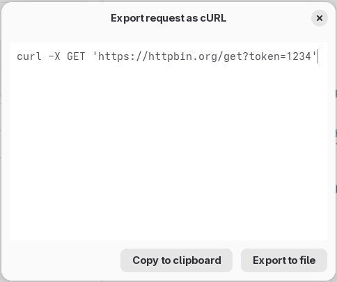

# Exporting requests and responses

You can use the Export menu to copy or save requests and responses.

Please note that at the moment, variables are usually embedded into the
exported requests. This includes variables taken from .env variables. Take
care to avoid leaking tokens or API keys if you export your requests and
share them with third parties.

## Export request as cURL

Use the **Export request as cURL** option to export the request as as a cURL
command. You can paste the generated command into your terminal to send the
same HTTP request using cURL.

Here are some implementation notes for the generated command:

* The HTTP verb and URL are exported as you might expect.
* Headers are appended with the `-H` argument.
* If you are using HTTP Basic Authentication, the credentials are set using
the `--basic` and `-u` arguments, like in `--basic -u admin:1234`.
* If you are using HTTP Bearer Authentication, the token is set using the
`--oauth2-bearer` argument.
* If you are exporting an URL Encoded or raw body, it is set using the `--data-raw`
argument. The whole payload is urlencoded and appended.
* If you are exporting a Multipart payload, the text parts are exported using
the `-F` argument.
* If you are exporting a body read from a file, it is encoded using the
`--data-binary` option, and the path to the file is added prepended by the `@`
symbol. You will need to have the file in the correct location for the command
to work.

## Export request as Jetbrains HTTP

The JetBrains products integrate an HTTP Client right inside the IDE. This HTTP
Client uses the .http file format. It is possible to edit and send requests in
this format right from JetBrains.

You can learn more about this HTTP client and about the .http file format
[in their official documentation](https://www.jetbrains.com/help/idea/http-client-in-product-code-editor.html).

The .http files used by JetBrains HTTP client are not the same as the .http files
used by Visual Studio 2022 and above ([docs](https://learn.microsoft.com/en-us/aspnet/core/test/http-files?view=aspnetcore-9.0)) or the [REST Client extension](https://marketplace.visualstudio.com/items?itemName=humao.rest-client) available for Visual Studio Code and VS Code-compatible editors.

HTTP files exported by Cartero may work or may not work in Visual Studio and the REST Client extension. An exporter for Visual Studio and REST Client may be added in the future if enough interest is seen. Share your feedback in the discussions, specially if you find requests that don't work in Visual Studio or the REST Client extension.

Use the **Export request as Jetbrains HTTP** to export the request into an HTTP file snippet.
You can copy this file into your IDE, or save it to a file.

Here are some implementation notes:

* The exporter in use by Cartero was compared against the
[HTTP Client CLI](www.jetbrains.com/es-es/ijhttp/download/) tool to make sure that IJHTTP understood the exported files, but was not tested against
the HTTP Client available in the JetBrains IDEs, because this feature was not
available in the Community Edition of these IDEs. Only one test failed, because it turns out that IJHTTP and the HTTP Client integrated in JetBrains currently [fail to send a multipart payload when there are multiple parts with the same name](https://youtrack.jetbrains.com/projects/IJPL/issues/IJPL-162534/HTTP-Client-Multipart-with-multiple-files-and-same-name-is-broken). Every other .http file generated by Cartero was accepted by IJHTTP, and [I tested a lot of files](https://github.com/danirod/cartero/tree/trunk/crates/cartero-code-exporters/tests/ijhttp).
* Just as the original spec by Jetbrains, the Basic authentication scheme is not encoded in base64, so the header will be included in plain text (`Authorization: Basic admin 1234`).
* IJHTTP files expect a boundary to be manually given in multipart requests. Cartero generates a boundary when exporting to IJHTTP.
* When the request body mode is set to **From file**, the path is added to the .http file prefixed by the `<` symbol. You might need to distribute your file with the .http file for the request to successfully work.

## Export response body

Choose this option to save the contents of the response currently visible in the pane into a file.

## Future file formats

There is interest in adding support for the following file formats to export a request:

* [HTTPie CLI command](https://httpie.io/docs/cli).
* [PowerShell's `Invoke-WebRequest` command](https://learn.microsoft.com/en-us/powershell/module/microsoft.powershell.utility/invoke-webrequest?view=powershell-7.5).
* [Bruno .bru files](https://github.com/brulang/bru-lang).
* [The HTTP file format for the Visual Studio Code REST Client extension](https://marketplace.visualstudio.com/items?itemName=humao.rest-client).
* [The HTTP file format for Visual Studio 2022 and above](https://learn.microsoft.com/en-us/aspnet/core/test/http-files?view=aspnetcore-9.0).

There is also interest in supporting code snippets:

* Export as JavaScript fetch().
* Export as Go code (net/http).
* Export as C libcurl code.
* Export as Python requests.
* Export as Ruby Net::HTTP or Faraday.
* Export as Rust Reqwest or Isahc.

Additionally, there is interest in exporting the whole request and response as a HAR document. [There is a draft in the W3C website](https://w3c.github.io/web-performance/specs/HAR/Overview.html), but the big red banner that says "Do not use" is scary.

If you know other well known request formats, propose them in the discussions.

If you know how to write [Askama](https://askama.readthedocs.io/en/stable/) templates in Rust and you have ever wondered: "can I contribute code to Cartero?", then your template would be gladly accepted.

