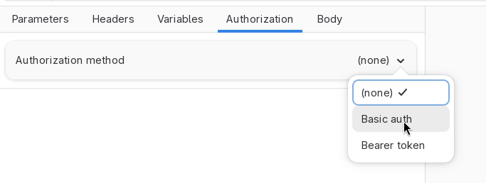
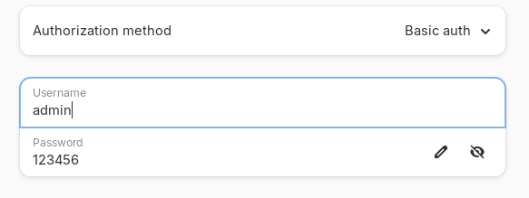
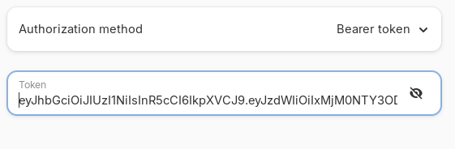

# Authorization

You can use the authorization settings to quickly set the authentication and
authorization of an HTTP request. While you could manually type the headers
by yourself, authorization often offers a faster way to introduce that data.

Use the **Authorization** tab to control authorization of an HTTP request.
The **Authorization method** dropdown will let you choose how is the request
authentication and authorization assigned.

Note that you can always manually set the headers of an HTTP request to issue
your own authentication headers. Please note that in case of conflict, your
headers will override the headers set by Cartero when the authorization tab
is also configured.

## Basic auth

Basic auth works in conformance with [RFC 7617](https://datatracker.ietf.org/doc/html/rfc7617).
Fill the **Username** and **Password** fields with the username and password.
Cartero will add a header called `Authentication` to the HTTP request.
The value will be `"Basic " VALUE`, where `VALUE` is defined as the base64
representation of the string `USER ":" PASSWORD`, being `USER` and `PASSWORD`
the credentials set.

So for example, if you set the user to `admin` and the password to `123456`,
the string `admin:123456` will be encoded in base64 (`YWRtaW46MTIzNDU2`),
and the `Authentication` header of the request will be set to `Basic YWRtaW46MTIzNDU2`.

## Bearer token

Bearer token works in conformance with [RFC 6750](https://datatracker.ietf.org/doc/html/rfc6750).
Fill the **Token** field with the bearer token of the HTTP request. Cartero
will add a header called `Authentication` to the HTTP request. The value
will be `"Bearer " TOKEN`, where `TOKEN` is the token set in the request.

So for example, if you set the token to `admin-token-1234`, a header called
`Authentication` will be added to the request, with the value set to
`Bearer admin-token-1234`.

## Future methods of interest

There are a lot of authentication methods out there. [MDN defines a few of them](https://developer.mozilla.org/en-US/docs/Web/HTTP/Guides/Authentication#authentication_schemes).

There is interest in the future of adding support for the following authentication methods:

* API key (manually adding a value to an extra header or query param).
* A full OAuth 1.0 flow.
* A full OAuth 2.0 flow.
* AWS4-HMAC-SHA256.

You can propose additional authentication methods in the issue tracker or
discussions area.
