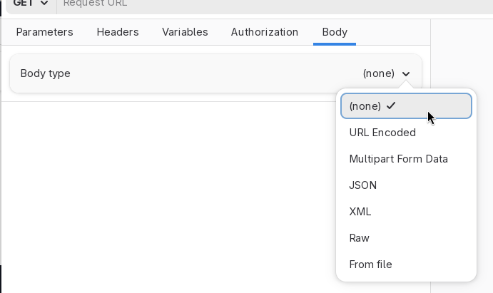
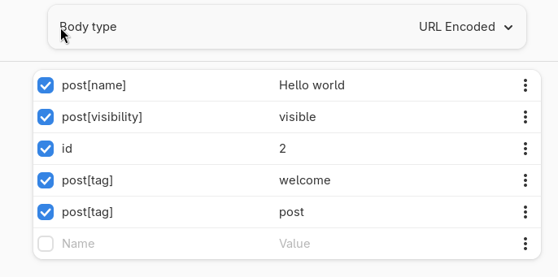
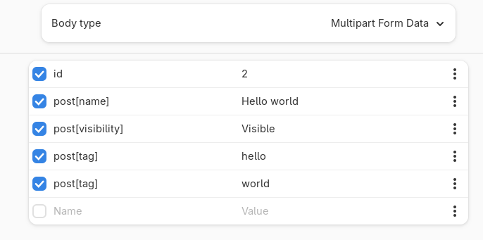
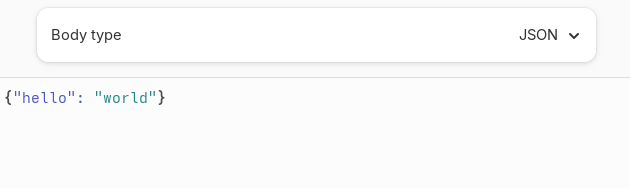
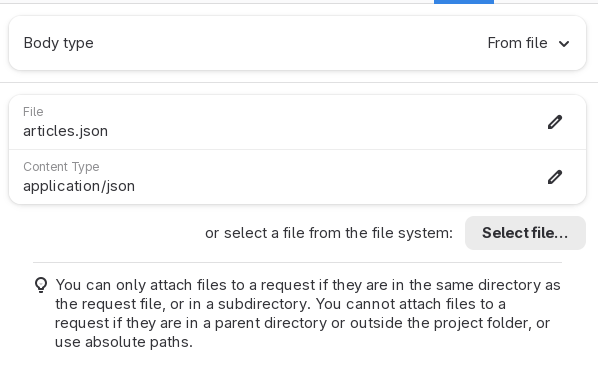

# Body

Use the **Body** tab to attach payloads to an HTTP request.

Note that Cartero will allow you to attach payloads to any kind of HTTP request.
However, while the HTTP semantics technically allow you to attach payloads to
GET requests, you should not attach a body to a GET request.

Note that most requests that use bodies will have some extra headers set in
the HTTP request:

* `Content-Type`, for the content-type of the payload you are sending, such as `multipart/form-data` or `application/json`.
* `Content-Length`, for the length in bytes of the payload you are sending.

Use the **Body type** dropdown to pick what kind of payload you want to use.



## URL Encoded

When using URL Encoded as the body, the body is sent in `application/x-www-form-urlencoded`,
in conformance to the rules described by the [WHATWG URL spec](https://url.spec.whatwg.org/).

A table is presented, where you can add names and values. Each pair of name and value
makes a tuple, and when the request is sent, all the tuples in the table is encoded
as an URL and serialized in x-www-form-urlencoded format.

This format is similar to the one used by query params in an URL. However, when used as a
body, the full payload that would be used as a query string otherwise is sent as part of the
body of the HTTP request.



In the previous screenshot, many tuples are defined:

* `post[name]` = `Hello world`
* `post[visibility]` = `visible`
* `id` = `2`
* `post[tag]` = `welcome`
* `post[tag]` = `post`

This is encoded as an URL encoded string: `post%5Bname%5D=Hello+world&post%5Bvisibility%5D=visible&id=2&post%5Btag%5D=welcome&post%5Btag%5D=post`, and sent to the server. It is up to the server to parse and decode this, but most server frameworks will already do it for you. For example,

```json
{
    "id": [
        "2"
    ],
    "post[name]": [
        "Hello world"
    ],
    "post[tag]": [
        "welcome",
        "post"
    ],
    "post[visibility]": [
        "visible"
    ]
}
```

Note the following:

* You can have multiple tuples with the same key. It depends on the implementation,
  but most servers will treat multiple tuples with the same key as an array, so every
  value is collected and added into the final value.
* Unless the tuple is part of an array, the order of the tuples should not matter
  a lot.
* Tuples have no concept of data types. Everything is a string, even when you try to
  encode a number.

## Multipart

Multipart encodes bodies following the `multipart/form-data` content type
defined in [RFC 7578](https://datatracker.ietf.org/doc/html/rfc7578).

This method encodes **parts**. Parts are sub-documents included in an HTTP
request. They encode more information than a raw URL encoded string. Each
part can have its own name and content-type. Therefore, often they are used
to encode file attachments, because it is possible to assign the content-type
of the source file and the file name, and mix this with other kinds of parts,
allowing to send mixed forms with some inline plain text inputs and some
file uploads.

<div class="warning">
Please note that Cartero does not support attaching files to a multipart
request at this moment, which makes this body type less useful than what
it should be. This feature is under development.
</div>



## Raw, JSON and XML

When you encode as Raw, JSON or XML, you can set the payload directly, which
is sent to the server as you type it, with no extra manipulations done by
Cartero.

If your API expects parameters to be passed using JSON documents, this is
probably the one you are looking for.

Note that depending on the actual value that you pick from the dropdown,
a `Content-Type` header may be attached to the request with different values:

* When you use `Raw` body types: `application/octet-stream`.
* When you use `JSON`: `application/json`.
* When you use `XML`: `application/xml`.

If you need to set a more specific content-type, such as using `application/json+ld`,
you will have to manually override the header by setting the header in the
Headers tab to the value you wish.

When the body type is set to JSON or XML, Cartero will color the text area
to make it easier to type the payload.



## From file

From file lets you upload the payload directly from a file. If you want to
send a large JSON file generated by an external tool, or a payload that is
difficult to deal in Raw mode, you can provide the file externally.



Set the mode to **From file**, and then specify the path to the file as the
**File** field, and optionally the content type of the file in the **Content
Type** field. If the content type is not given, it will be assumed as
`application/octet-stream`.

You can also use the **Select file** button to choose a file. When possible,
the content type of the picked file will be infered, if the system libraries
are present.

<div class="warning">
Guessing the content type is an experimental feature that depends on external
libraries. These libraries are usually installed on GNU/Linux systems. It is
likely possible that content type won't be guessed at the moment on Windows
and on macOS, or if the MIME types parser is not installed.
</div>


There are a few **restrictions** when using this feature. They were set for
security reasons, to avoid the risk of running malicious request files that
could submit sensitive information over the internet:

1. You cannot use absolute files. So it is not possible to use
   `/home/user/.npmrc` as the file to upload.
2. The file must be either in the same directory or under a subdirectory. So
   you can use `payload.json`, `samples/new-user.json` or
   `test/fixtures/user.json`, but you cannot use `../npmrc`.
3. The request file must be saved first, because it needs to know how to find
   the relative file.

## Under development

Uploading files as part of a multipart request is currently not available, but
it is a feature that is requested often and work is in progress to support it.
Attaching files as part of the request is not difficult, but designing the
user interface to make the feature easy to use and integrated in the table
seems to be more difficult.
