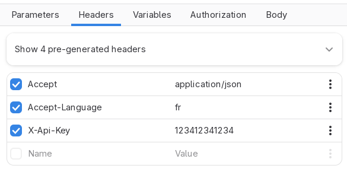
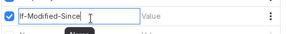
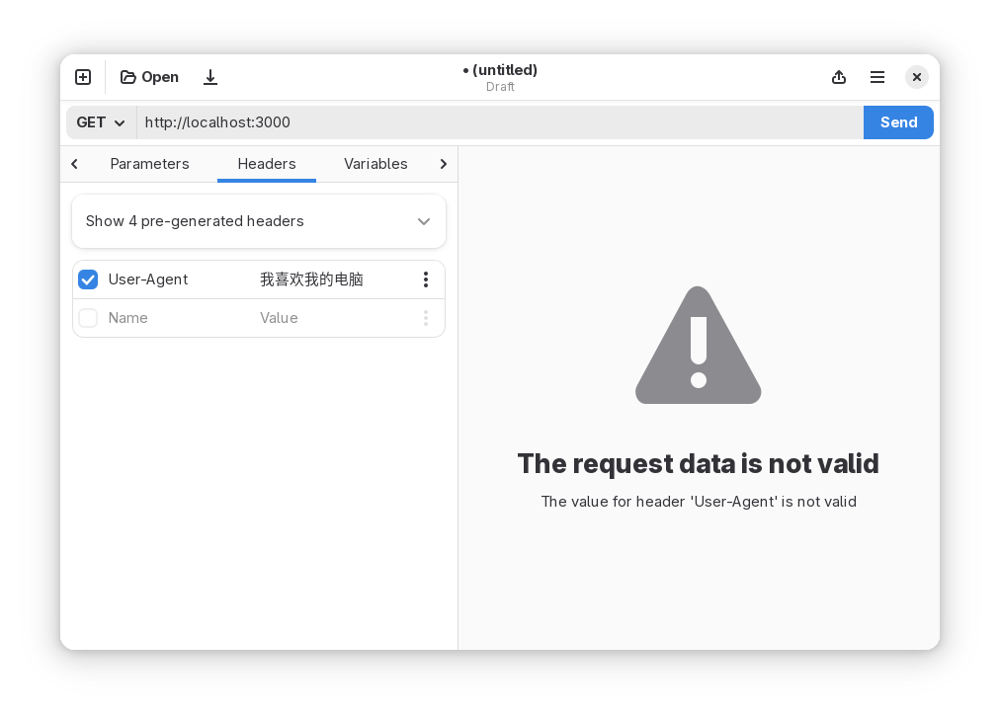
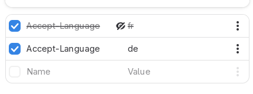

# Headers

This tab allows you to set headers that will be included as part of the request.

## Adding a new header

To add a header, start typing the Name or the Value into the placeholder row
that you see as the last row of the table. (If the table is empty, the last
row is the first row too.)

Continue filling both the **Name** and the **Value**. The header will use the
designated Name and Value as header name and header value.

You can quickly disable a header without removing it by toggling the checkbox
that is next to each row. Press the checkbox again in order to enable it again.

The extra dropdown menu allows you to do a couple of things:

* Toggle secret. This will mask the value in the row to hide it with asterisks. **This is purely cosmetic**. It is designed as a way to hide values, for instance if you are screensharing your screen. However, the value will be sent as is in your HTTP requests. **Additionally, the value will be saved plain text in request files**.
* Delete. This will delete the row completely. **Does not currently ask for confirmation, does not undo at the moment**. (But it should!)

If you use [variables](./variables.md), you can add them here by placing the name of the variable between two curly brackets, like in `{{ VARIABLE }}`. Spaces are optional.

## Pre-generated headers

Above the table, there is an action row that says something like "Show 4 pre-generated headers". Note that the exact number of pre-generated headers will depend on the current configuration of the Authorization and Body panes of Cartero, because some methods may add additional HTTP headers.

Either way, if you press the action row to expand it, you will see some headers that will be sent by Cartero even if you don't set them by yourself. These are usually headers configured automatically based on the state of the HTTP request. For example, when you set an authorization method using the Authorization tab, Cartero will usually generate an Authorization header.

Note that you can override these values by creating your own header with the same name. In case on conflict, a header defined explicitly using the Headers tab will always override one of the generated by Cartero. In case of conflict, the pre-generated header will be ignored, as seen by the checkbox being disabled.

## Header limitations

Following the HTTP spec, these limitations apply.

**Cartero assumes that the order of the headers does not matter.**
(In fact, they don't). At the moment it is not possible to change the order
of the rows of the table.

It is not possible to use non-ASCII characters in a header name or value.
The HTTP spec recommends escaping the characters or encoding them using
URI encoding. Cartero will detect invalid usage of characters and report it.

Cartero currently does not support multiple headers with the same name. If
there is more than one row with the same name, only the lowest value in the
table will be used, overriding any previous value.

This is technically not correct, because there are some headers that accept
duplicate keys (cookies, for example). [Section 5.2 of RFC 9110](https://www.rfc-editor.org/rfc/rfc9110.html#section-5.2) covers this. Until Cartero supports this
behaviour, you can collapse every value into a single header, using a comma
as a separator.
