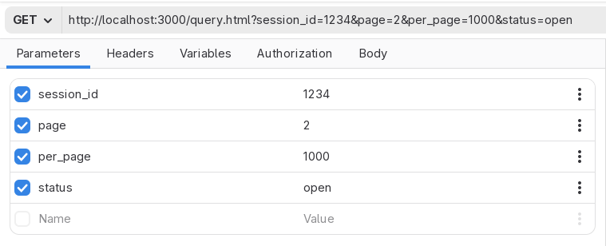

# Parameters

This tab allows you to set the query parameters (also known as URL parameters)
of the URL currently typed in the request URL field. This is a way to quickly
scan the query string in a tabular way.

The last item of the table is a placeholder that you can use to create new
query parameters. If you want to quickly add a new query param, start typing
into the **Name** or **Value** placeholders.

The parameters pane allows you to quickly disable a query parameter, by pressing the
checkbox that is next to each row. Disabling the checkbox will remove the query parameter
from the request URL and will cause it to not be sent. Enable the checkbox again to
restore the parameter.

## Parameter options

The extra dropdown menu allows you to do a couple of things:

* Toggle secret. This will mask the value in the row to hide it with asterisks. **This is purely cosmetic**. It is designed as a way to hide values, for instance if you are screensharing your screen. However, the value will be sent as is in your HTTP requests. **Additionally, the value will be saved plain text in request files**.
* Delete. This will delete the row completely. **Does not currently ask for confirmation, does not undo at the moment**. (But it should!)

## Remarks

1. There is currently no way to change the order of the rows of the table. (But it would be nice to have this feature.)
2. The order for the query parameters is currently not defined. In other words, sometimes the application may move parameters up or down. This is the case if you tweak the table, disable some parameters, and then modify the URL field, or if you save a request that has disabled query parameters. The HTTP spec does not define a specific order, in other words, this should not matter. However, some servers or endpoints that still choose to parse the parameters in order as an implementation detail may not like that, even if it's not recommended in first place. Granted, if Cartero ever has a way to sort the rows of a table, this issue would be fixed.
3. There is no undo/redo for the table at the moment. If you delete a row, the row is gone (unless you can rollback to a saved version of the file).
