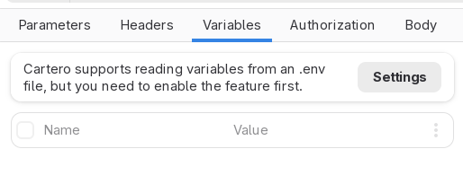
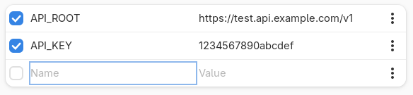
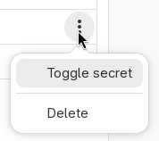
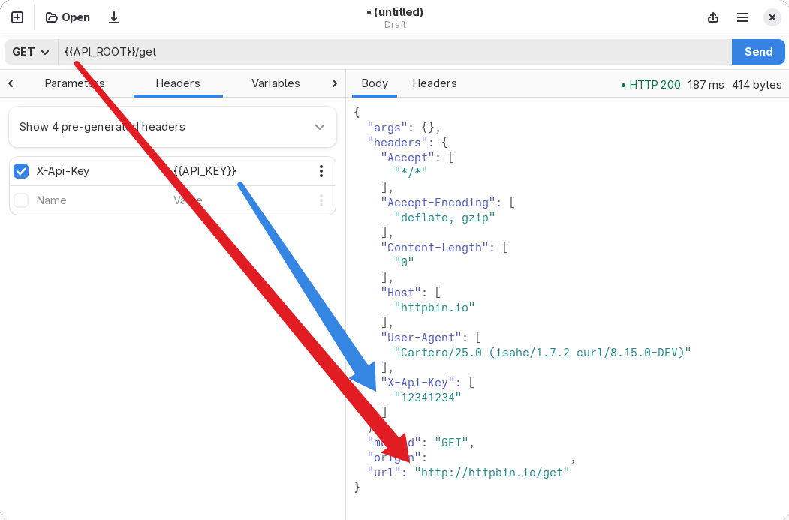
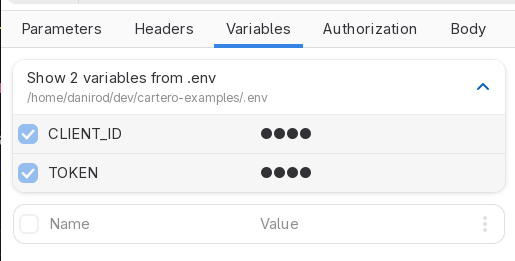

# Variables

You can define variables to avoid hard-coding values to other parts of a
request, such as the URL, query params or headers.

When you use variables, you can define special identifiers, such as `API_URL`,
`ACCESS_TOKEN` or `FILTER`, and use them in other parts of a request. When the
request is done, the identifier is replaced with the value of the variable.

Use this to avoid repeating data that changes often, to keep data that depends
on the environment organized, or to collect or hide sensitive information
through the use of .env files.

You can view, set, toggle or delete variables from the **Variables** tab in the
request area.

## Defining variables

**To define a variable**, add a new entry to the variables table. The name
will be the value used to reference the variable. The value will be the
contents that you want to give to the variable.

In the previous screenshot, there are two variables: `API_ROOT`, whose value
is `https://test.api.example.com/v1`, and `API_KEY`, whose value is
`1234567890abcdef`.

There are a few things that you could do with these variables.

You can quickly disable a header without removing it by toggling the checkbox
that is next to each row. Press the checkbox again in order to enable it again.
**When a variable is disabled, it is ignored**. You can use this to define
multiple variables with the same name and quickly toggle the value of the
variable, for example.

The extra dropdown menu allows you to do a couple of things:

* Toggle secret. This will mask the value in the row to hide it with asterisks. **This is purely cosmetic**. It is designed as a way to hide values, for instance if you are screensharing your screen. However, the value will be sent as is in your HTTP requests if you use the variable. **Additionally, the value will be saved plain text in request files**.
* Delete. This will delete the row completely. **Does not currently ask for confirmation, does not undo at the moment**. (But it should!)

## Using variables

To use a variable, wrap the name of the variable between two pairs of curly
braces, like in `{{ API_ROOT }}`. Note that the spaces between the curly braces
and the variable name are optional, but in most cases they are a good idea, in
order to keep the variable readable.

Variables are case sensitive, so `{{ API_ROOT }}` is not the same as `{{ api_root }}`.

You can use variables in most situations:

* To define URLs. For instance, `https://{{ HOST }}/v1/users`.
* In tables, such as parameters, headers, multipart or URLencoded bodies.
* As part of a raw payload, such as JSON or XML.
* In an authorization payload, like the bearer token.

**Currently it is not possible to escape raw curly braces.**
(But this should totally be added to the program.)

## Using or inspecting .env variables

As described in the chapter [**Using .env files**](../advanced/env.md), it is
possible to read variables from an .env file. When this feature is enabled,
the .env file will be read during a request, and the variables defined in the
.env file will be accessible as normal variables, even if they were not defined
inside Cartero.

If this feature is enabled, you can toggle the action row "Show N variables from .env"
in order to display the names of the variables. For security reasons and to
prevent leaks if you are sharing your screen, the variable values are not
visible.

