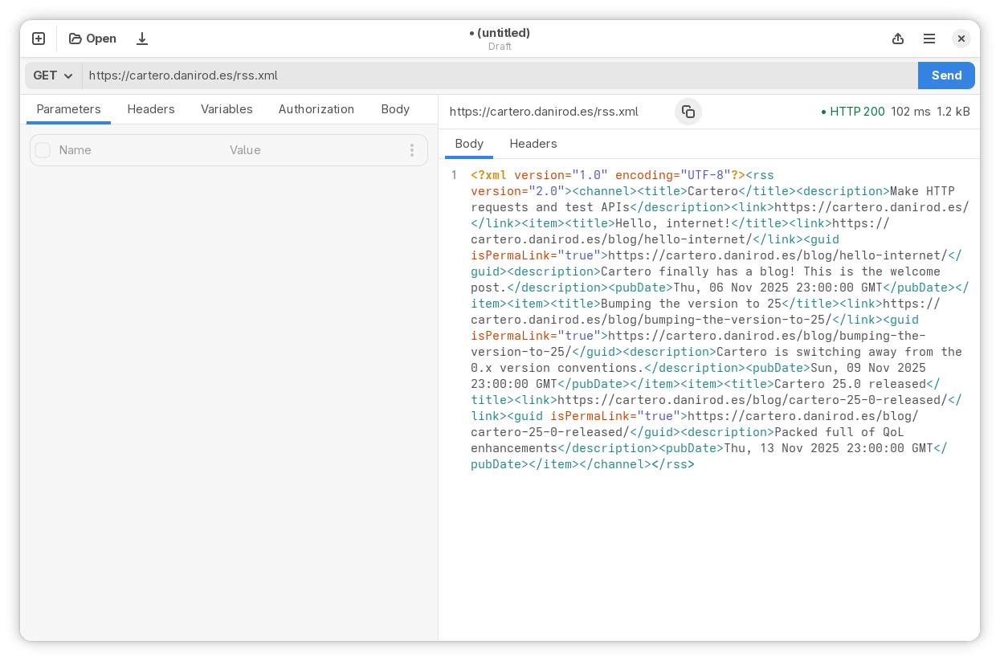
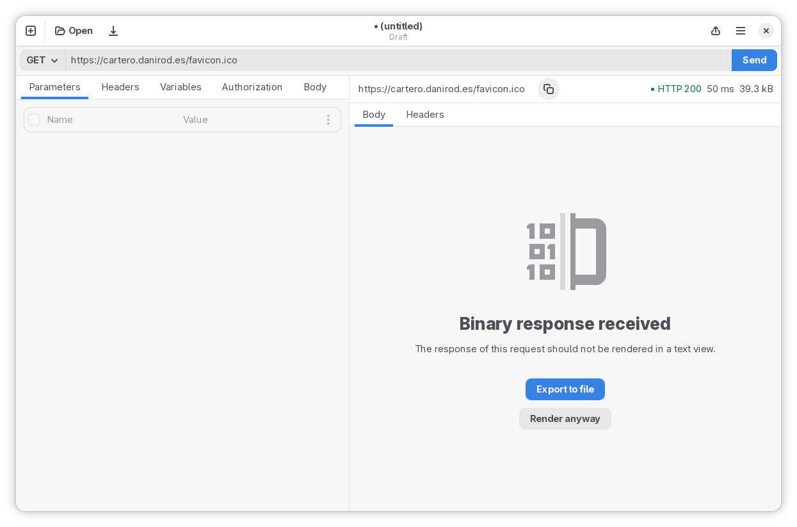
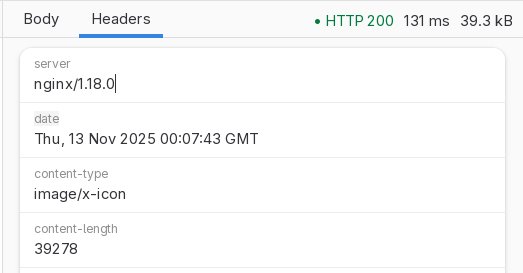
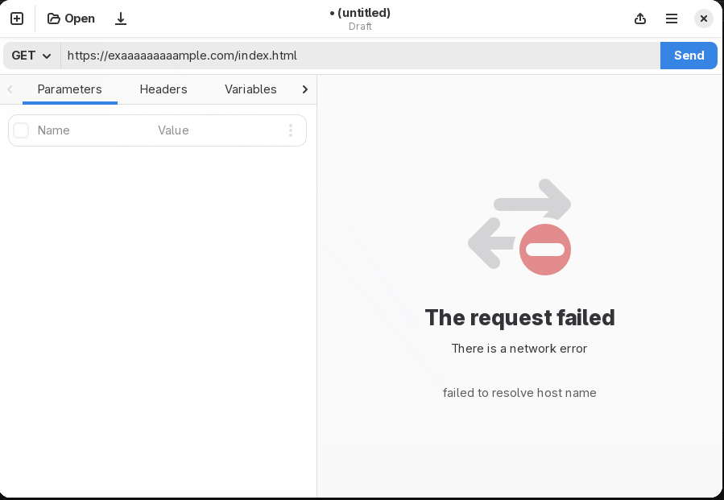

# Understanding your response

When you send an HTTP request, you will receive either your response, or an
error message.

If the response goes OK, you will see in the response pane a notebook with
some panes, described below:

* Body: used to render the response body.
* Headers: used to check the HTTP response headers.

Additionally, you will see in the opposite site of the notebook header three
values: the received HTTP status code, the duration of the HTTP request, and
the size of the response body.

## Response body

When you receive a response, the **Body** tab will present the contents of the
response.

If the response is using a valid content type, it will be highlighted. This is
the case for many response formats, like JSON, XML, HTML...

If the response is JSON, additionally, right now it will be formatted and
prettified if possible, to make it easier to read. If you want to configure
the way the response body is presented, you might visit the settings, section
**Code editor**.

## Binary responses

If Cartero receives a binary response, it will show a warning instead. You
can use the **Export to file** button to save the response to a file, in order
to inspect it with a more appropiate tool. If you believe this is a mistake,
or you really want to see the binary data inside Cartero, you can press the
**Render anyway** button to present the response into the body tab, but this
might render gibberish.

## Response headers

Use the **Headers** pane to inspect or copy the HTTP response headers.

## Request errors

When a request goes wrong and it becomes impossible to retrieve a valid
response, an error message is presented instead. In the following example, the
HTTP request is made to a server whose host name could not be resolved, so
an error is presented.

