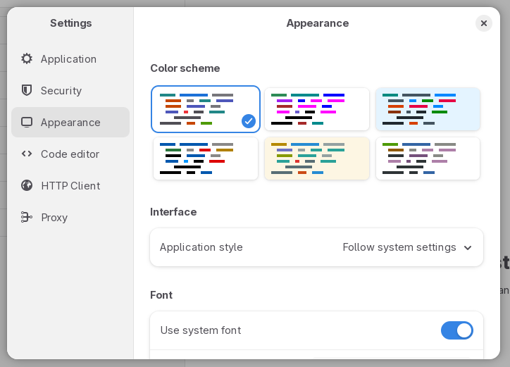
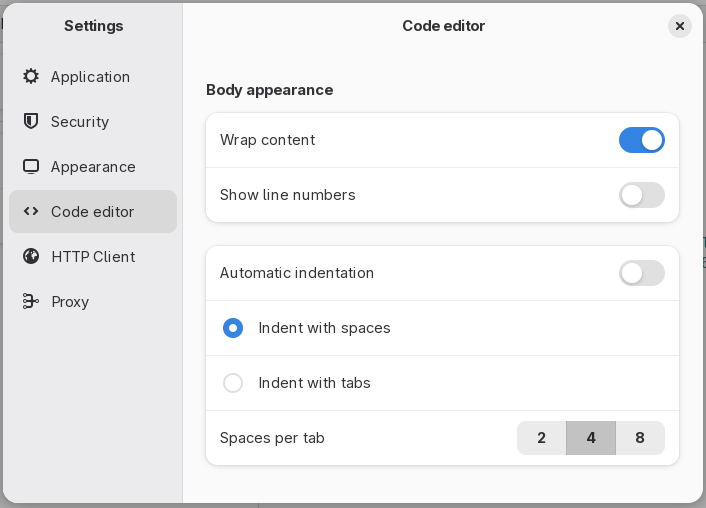
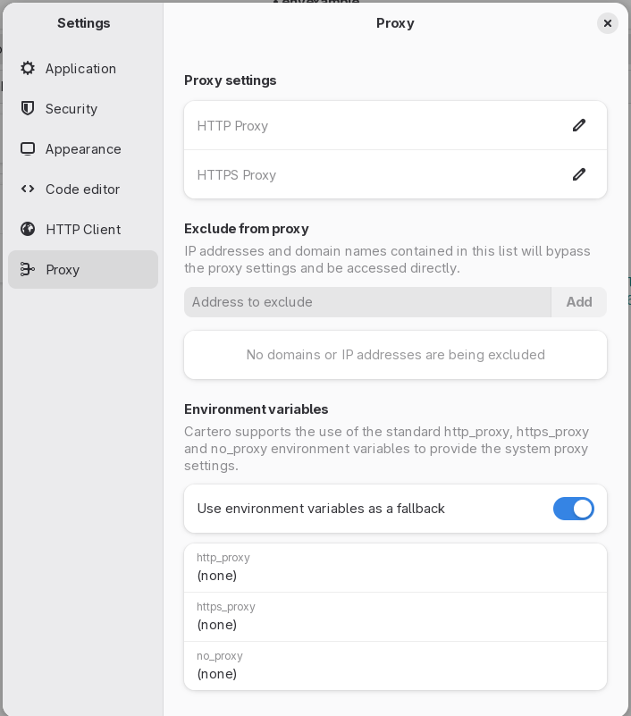
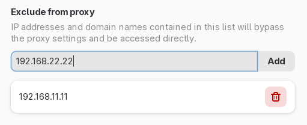

# Settings

Press `Ctrl` + `,` or open the **Settings** menu from the application dropdown
menu to open the settings dialog.

You can use the settings dialog to control multiple parts of the application.

## Application

The following options are available:

**Language**:
* **Language**: Cartero will try to use your system language by default. If the
language was not picked correctly, or if you want to override, you can switch
to a different language. You will have to restart Cartero. You can contribute
translations through [Weblate](https://hosted.weblate.org/projects/cartero/cartero/).

**File settings**:
* **Create backup files**: if enabled, every time you save a request file,
  the older version of the file will be saved into a backup file before being
  overwritten by the new changes. This option is not very useful when you
  already have your own backup system in use, such as a version control
  system.

**Software updates**:
* **Check for updates**: press this button to query if there is a new version
  of Cartero that you can download and install.

Checking for updates is only available when Cartero is compiled
  with support for checking or updates. The pre-compiled Windows and macOS
  versions come with this feature enabled, and so does the AppImage precompiled
  version for GNU/Linux. This feature is not available in the Flatpak or
  Snapcraft version of the application, and most OS repositories will likely
  disable this feature, as your GNU/Linux package manager will have a package
  update policy, or your application store will likely have a way to check for
  updates.

Pressing the <strong>Check for updates</strong> button will trigger an HTTP request to the
GitHub API. The exact endpoint that will be queried will be
<code>https://api.github.com/repos/danirod/cartero/releases/latest</code>. The
privacy policy of GitHub may apply.

## Security

These options control additional security settings that can be used to enable
dangerous actions.

**.env files**:
* **Find and load .env files**: Cartero will only find and read .env files to
  use the variables within the requests if this option is enabled.

## Appearance

Control how the application looks.

* **Color scheme**: the color palette in use by the text editors and app.
* **Application style**: set the theme to light, dark, or use the global
  style defined by the settings of your operating system.
* **Use system font**: when enabled, Cartero will use the default monospace
  font of your system for the code view text editors, such as the response
  view or the request body view.
* **Custom font**: when you disable the **use system font** toggle, you can
  set the font family and size that you want to use to render the code view
  editors.

## Code editor

These options control how the code editors present in the request body raw
payload editor behave. They also influentiate how the response bodies look,
even if the response body is not editable.

**Body appearance**:

* **Wrap content**: if this option is enabled, long lines will be split in multiple lines.
If the option is disabled, you will have to horizontally scroll to read long lines.
* **Show line numbers**: puts the typical line number counter that you see in most
code editors in the editor gutter.
* **Automatic indentation**: if you enable this option, the code editor will
indent new lines based on the indentation settings of the previous line.
* **Indent with spaces** / **Indent with tabs**: What do you want to insert to
the payload then the Tab key is pressed.
* **Spaces per tab**: either how many spaces should be inserted when pressing Tab, or how wide should the tabulator be.

## HTTP Client

The following options are available under the **HTTP client** section:

* **Enforce TLS validation**: Cartero will present an error message if the TLS
  handshake goes wrong. Disable this to continue the request, even when the
  certificate is not valid.
* **Follow redirects**: if enabled, Cartero will not stop at an HTTP 301, 302,
  307 or 308 response code. Instead, it will look for the next URL in the
  `Location` header and send a new HTTP request. Note that there is a limit
  to prevent infinite lookups, that can be configured using the **Maximum
  redirects** control that appears when enabled.
* **Request timeout**: configure the maximum time that Cartero will wait for
  the response to be received until it bails out and timeouts the whole request.
  Units are seconds. If your endpoint is slow and takes some time to process,
  you might want to bump this value. The maximum value right now is
  1000.0 seconds.

## Proxy settings

* **HTTP Proxy**: specify the proxy to use for HTTP requests. This proxy will NOT be
  used by HTTPS requests.
* **HTTPS Proxy**: specify the proxy to use for HTTPS requests. This proxy will NOT
  be used by HTTP requests.
* **Exclude from proxy**: this is a list of sites that will not pass through the
  proxies. Requests will be made directly to the site. To add a site, type the address
  into the "Address to exclude" control, and then press the Add button. To delete a
  previously added excluded site, click the trash can button near the address.
  
* **Use environment variables as a fallback**: If the proxy options are empty in
  Cartero, it will read the settings from the environment variables if this
  option is enabled. Cartero supports the use of the standard `http_proxy`, `https_proxy` and `no_proxy`
environment variables used by curl. [Read the curl docs](https://curl.se/docs/tutorial.html#proxy)
for more information.

## Under development

Future ideas that will be available here:

* **Application color schemes**: to use a different color for your windows,
or to provide additional color schemes for the text editors.
* **Authorized hosts**: an extra security layer that will make Cartero ask
for confirmation before sending an HTTP request, unless the hostname of the
request is added to a trusted hostname list.
* **Client certificates**: a special kind of certificate validation used in
the corporate world.
