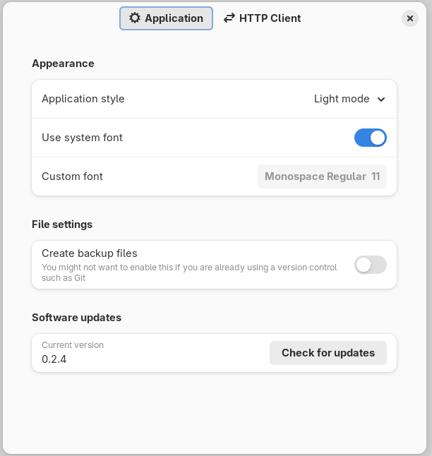
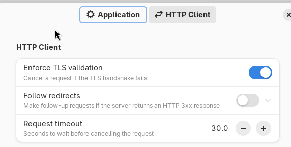

# Settings

Press `Ctrl` + `,` or open the **Settings** menu from the application dropdown
menu to open the settings dialog.

You can use the settings dialog to control multiple parts of the application.

## Application

The following options are available:

**Appearance**: control how the application looks.
  * **Application style**: set the theme to light, dark, or use the global
    style defined by the settings of your operating system.
  * **Use system font**: when enabled, Cartero will use the default monospace
    font of your system for the code view text editors, such as the response
    view or the request body view.
  * **Custom font**: when you disable the **use system font** toggle, you can
    set the font family and size that you want to use to render the code view
    editors.

**File settings**: control some aspects of loading or saving files.
  * **Create backup files**: if enabled, every time you save a request file,
    the older version of the file will be saved into a backup file before being
    overwritten by the new changes. This option is not very useful when you
    already have your own backup system in use, such as a version control
    system.

**Software updates**: this option is only present when Cartero is compiled
  with support for checking or updates. The pre-compiled Windows and macOS
  versions come with this feature enabled, and so does the AppImage precompiled
  version for GNU/Linux. This feature is not available in the Flatpak or
  Snapcraft version of the application, and most OS repositories will likely
  disable this feature, as your GNU/Linux package manager will have a package
  update policy, or your application store will likely have a way to check for
  updates.
  * **Check for updates**: press this button to query if there is a new version
    of Cartero that you can download and install.

Pressing the <strong>Check for updates</strong> button will trigger an HTTP request to the
GitHub API. The exact endpoint that will be queried will be
<code>https://api.github.com/repos/danirod/cartero/releases/latest</code>. The
privacy policy of GitHub may apply.

## HTTP Client

The following options are available under the **HTTP client** section:

* **Enforce TLS validation**: Cartero will present an error message if the TLS
  handshake goes wrong. Disable this to continue the request, even when the
  certificate is not valid.
* **Follow redirects**: if enabled, Cartero will not stop at an HTTP 301, 302,
  307 or 308 response code. Instead, it will look for the next URL in the
  `Location` header and send a new HTTP request. Note that there is a limit
  to prevent infinite lookups, that can be configured using the **Maximum
  redirects** control that appears when enabled.
* **Request timeout**: configure the maximum time that Cartero will wait for
  the response to be received until it bails out and timeouts the whole request.
  Units are seconds. If your endpoint is slow and takes some time to process,
  you might want to bump this value. The maximum value right now is
  1000.0 seconds.

## Under development

The next version of Cartero will feature more controls.

* Support for proxy settings has been added, and there will be a pane to
  control the proxy options, which hostnames should be excluded, and whether
  to use a different proxy for HTTP or HTTPS requests.
* The next version will support reading variables from .env files, and as
  a safety measure, you will have to manually enable the option from the
  settings, to make sure that Cartero does not read sensitive files without
  your permission.
