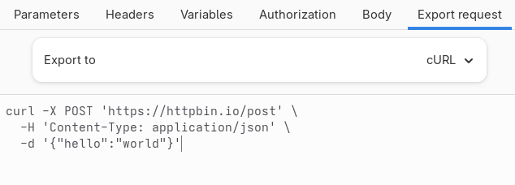

# Export request

Use the **Export** tab to convert the request into a different format. You can
use this to share the request with other people, or to quickly extract it in
an interoperable way.

Currently, only cURL can be picked from the dropdown. When you choose this
option, the equivalent cURL command required to run the HTTP request from the
command line will be presented. You can use the **Copy** button that appears
on the bottom right corner of the text view to copy the request to the
clipboard, in order to copy it.

## Under development

In the next version of Cartero, the following changes will be available:

* The cURL serializer will support additional body payloads and will
  encode the request in a way that is more readable by the human eye.
* There will be an exporter for IJHTTP (.http files). Note that Visual Studio
  and the REST Extension of Visual Studio Code also has support for .http
  files, but the dialect is different than the one in use by IJHTTP.
* It will be possible to save the payload to a file right from Cartero.
