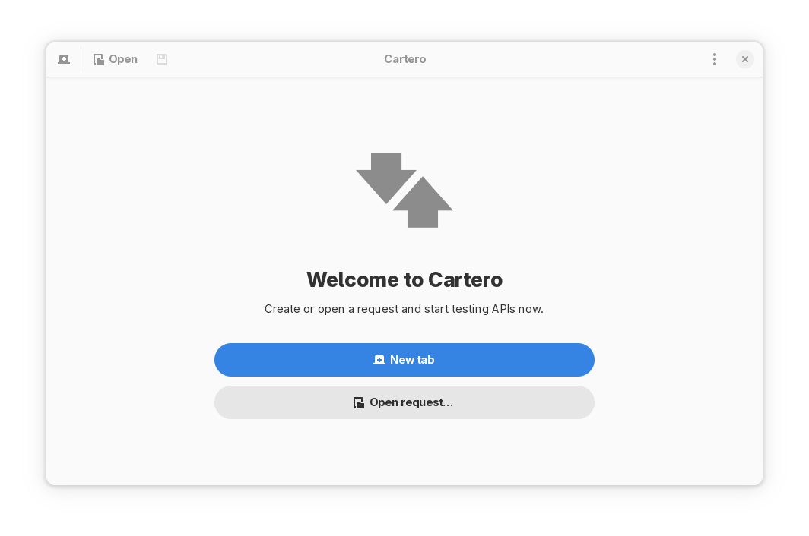
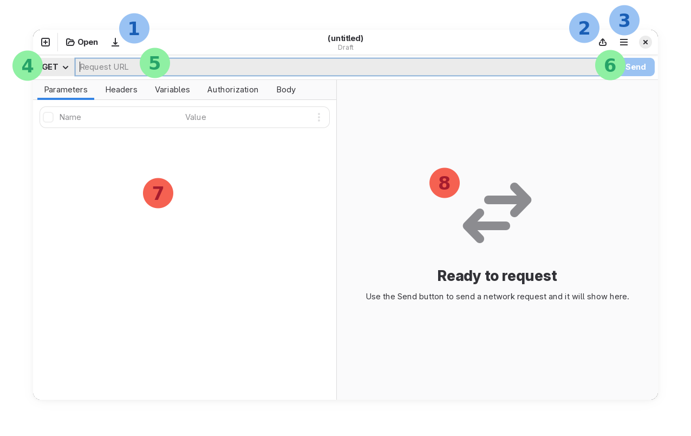
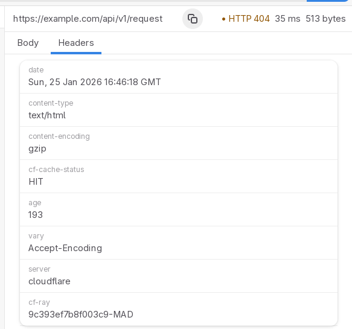

# Basic usage

## Starting Cartero

The welcome screen of Cartero is presented on first launch of the application,
or if you closed all the tabs before exiting Cartero the last time you ran
the program.

## Create a request

To start a new session, you will probably want to create a request. There are many ways to do this:

* Press the _New tab_ button in the welcome message.
* At any time, pressing `Ctrl + T` (`Cmd + T` on macOS).
* Use the _New tab_ button in the application toolbar.
* Choose _New tab_ from the application menu of the window.

## The endpoint layout

In Cartero 25.1, the endpoint pane is organized in sections:

The numbers in the previous screenshot point to the following sections:

1. File toolbar (new tab, open file, save file).
2. Share menu (export a request, save response).
3. Application menu (settings, etc).
4. HTTP method selector.
5. Request URL entry.
6. Send request button.
7. Request pane.
8. Response pane.

Usually, you configure a request through the URL bar and the request pane and
you see the results in the response pane after the HTTP request is sent. Read
the chapter [Configuring a request](request.md) for more information and tips
on how to prepare an HTTP request.

## Send a request

To send a request, press the **Submit** button, or press `Ctrl + Enter` (`Cmd + Enter` on macOS).
You need to set at least the URL of the request, or the action will not be enabled.

Once a response is received, you will see in the response panel information about it.

Read the chapter [Receiving a response](response.md) for more information and
tips on how to handle the HTTP response.

## Working with request files

You can save a request for future use. If you have a set of requests that you
find yourself doing often, you should save them to make them easier to access.

Cartero requests are saved into files with the .cartero extension. They are
plain text files that use the TOML language. The file format is designed to
be friendly with humans manually inspecting the file contents, but also
compatible with Git.

### Save a request

To save a request for later:

* Press the **Save** button in the toolbar.
* Press `Ctrl + S` (`Cmd + S` on macOS).
* Choose **Save request** from the application menu of the window.

### Open a request

To open a request:

* Press the _Open request_ button in the welcome message.
* At any time, pressing `Ctrl + O` (`Cmd + O` on macOS).
* Use the _Open_ button in the application toolbar.
* Choose _Open request...` from the application menu of the window.
