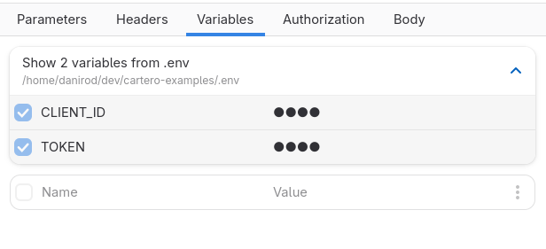
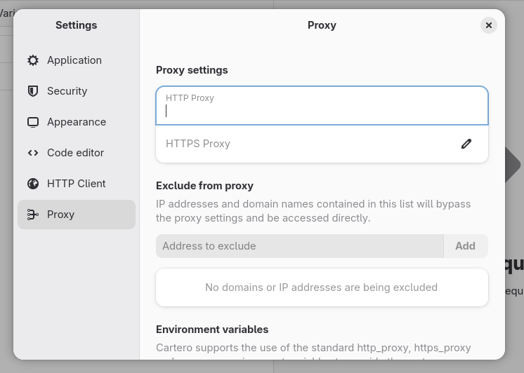
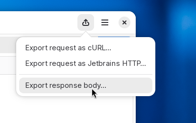
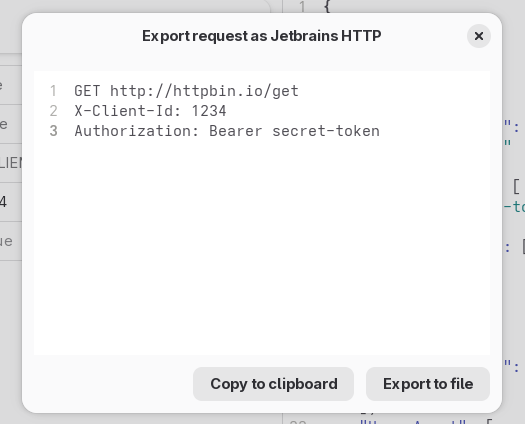
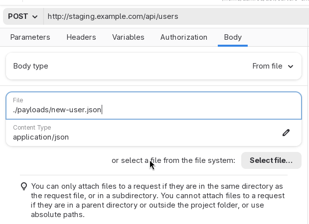
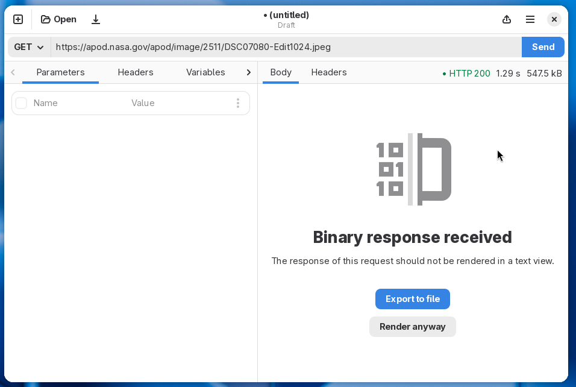
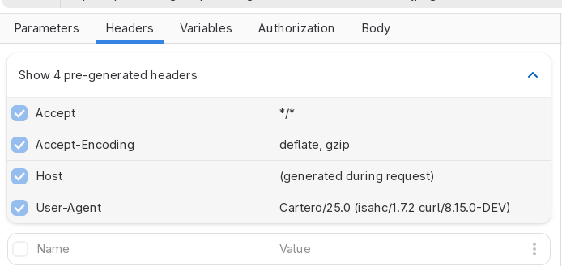
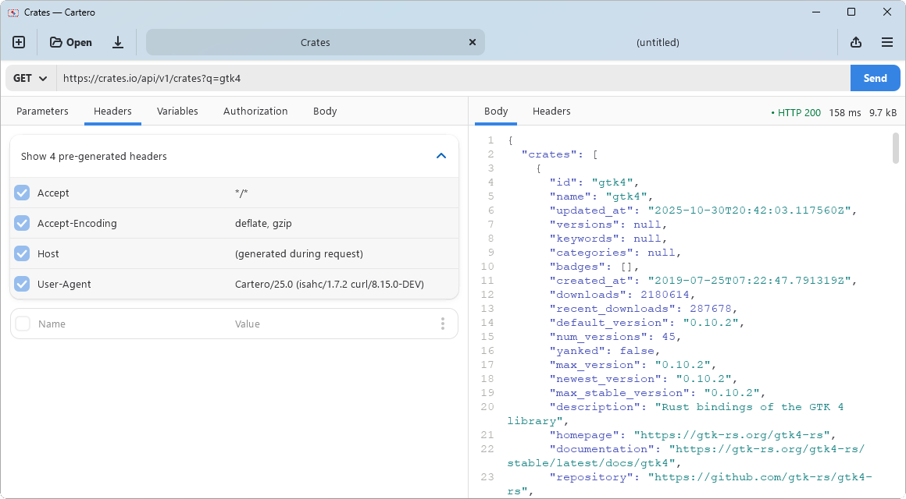

**Welcome to Cartero 25**. This version does not have a lot of overblown new features, but it has a lot of small new features designed to enhance the quality of life when using Cartero, and most importantly, it is a kickstart of the new project strategy. See [the blog post from last week](https://cartero.danirod.es/blog/bumping-the-version-to-25/) for more information. So, stay tuned for Cartero 25.1 very soon, and for Cartero 26 in just a couple of months!

When I say a lot of new small features I really mean a lot. There are too many changes, so let's get started. I'll begin with all the new things that you can see in this version, and then I'll talk about what's not visible.

## Support for .env files

If you develop or deploy web applications, you might have used .env files. They contain environment variables with credentials, endpoint roots and feature flags. Your web application reads this file on boot, and it allows to move sensitive values to a sidecar file, so that they are not inside your application code, and to make them easier to rotate.

Cartero is now able to read and use variables from .env files. When an .env file is read, environment variables defined in the file will be available just like any other variable. However, they won't be defined in the request file. This is good if you intend to share your request files, such as when using a Git repository, to keep sensitive values out of your request files.

<figure>

</figure>

If you are already using .env files for your project, and your request files are in the project, you might even share the variables with those of the project. Just think on the possibilities. Also, while this is not what I had planned for collections, this is also a way to share a variable among multiple request files.

## New settings window and support for proxies

Cartero has a new design for the settings page. Having an horizontal list of icons for the different sections was not very convenient, so now it will use a vertical sidebar. It is more sustainable and supports way more configuration pages. This will allow expanding the settings dialog with new options to configure future features currently in the backlog.

<figure>

</figure>

There is a new settings section for the proxy configuration. You can use this to configure the HTTP and HTTPS proxy, and the list of sites that should be excluded from the proxy settings. This feature was requested a lot, so I hope this makes it easier to deal with requests in corporate environments where the usage of a proxy is required to connect to the endpoint.

## New export framework

The export tab is now the export menu, and you find it in the application toolbar.

<figure>

</figure>

The cURL exporter has been reworked and now it will use more native cURL flags instead of just converting everything into an `-H` flag. Plus, every request body type now maps to valid responses, so it is possible now to export requests that make use of parameters as a cURL file.

Additionally, it is now possible to export requests in IJHTTP format. This is the format used by the HTTP Client integrated in the JetBrains IDEs. You can use this to export your request as an .http file that you can open right from JetBrains.

<figure>

</figure>

This was just a technological migration. There are a lot of exporters that can be done now thanks to the new framework, and future versions will have exporters for more formats, such as Bruno's .bru files, or the .http files used by the [REST Client](https://marketplace.visualstudio.com/items?itemName=humao.rest-client) extension for Visual Studio Code and VSX-based editors. Plus, exporting as code. Ideally we will start with a few code generators, such as JavaScript's fetch() function or the HTTP Client in the Go standard library.

## Set the payload from files

You can now choose 'From file' as the request body type. Cartero will read the contents of the file you provide when the request is done, and send the contents of the file as a payload.

<figure>

</figure>

Just to be clear: this is not support for files in multipart requests. This is a separate topic that will be finished very soon. This feature instead allows you to do things such as having the payload of your HTTP request in a separate file instead of typing it in the Raw text editor. If you already have payload files for your programming project, you might prefer this approach rather than duplicating data in the request files.

## Binary responses and custom response formatters

Previously, Cartero used to render the body of whatever response received after an HTTP request. If you requested things such as PDF files, images or audios, Cartero rendered gibberish, as it tried to convert every byte from the file into an UTF-8 string. Starting with Cartero 25, when a response with binary data is detected, the response panel will instead offer to download the response. You can still render the response in plain text if you want to, or if you consider it is an error.

<figure>

</figure>

In future versions, it will be possible to render binary responses as hexadecimal too, similar to the output of the hexdump command. It is a pretty niche feature, but it is a good prototype to see if it's easy to add special renderers for some data formats. If the experiment goes well, more renderers may be added later. Imagine viewing a CSV response as a table, or an image response as an actual image. JSON responses could have its own specialized tab with additional options such as a JSON tree view or search queries written in jq or JSONPath. These things have been in the roadmap for a very long time, but they needed some kind of UI framework to be useful.

## Header bonanza

There are some HTTP headers that are always included with every HTTP request, unless you override the value, such as the host of the content negotiation options. Starting with Cartero 25, you can preview these generated headers in the Headers tab. You can override the header by defining your own copy of the HTTP variable.

<figure>

</figure>

Cartero has a new user agent! We won't be using the default cURL user agent anymore, and Cartero will actually identify now as `Cartero/25.0`, or whatever version you are running. This change is useful because some servers reject HTTP requests from clients that identify just as `curl`. Again, you can override the value for this header by setting your own, but in the future we hope to have a configuration option to change the default user-agent.

## Microsoft Mica

For those using Cartero on Microsoft Windows, the title bar now has a more integrated look and feel, and uses the accent color, like other applications such as the Windows Notepad or the Task Manager. Overall, I think Cartero now looks nicer on Microsoft Windows. I understand you'd rather be using GNU/Linux, but if you work on a corporate environment, these things are out of your control. Let's make it less painful at least.

<figure>

</figure>

Please note that this feature requires Windows 11 because the APIs are not available in Windows 10 (which is still supported by Cartero, by the way). If you run the application on Windows 10, the same dull title bar will be used instead.

The devs at GNOME will probably not be very happy about this if they find out, but it is also interesting to explore the limits of the Adwaita theme and how to blend the design system with how other design systems expect an application to look like.

## Some minor visual improvements

And then for a quick round of changes:

* When you open a new request tab, the URL field will be focused by default. Less clicks to send an HTTP request.
* The tab panes now use the full available width. This means that if you run Cartero fullscreen on a 1080p monitor, it will make a better use of the screen instead of adding margins everywhere.
* If you press the eye button on a password field, such as the Basic auth password or the bearer token, it will be remembered. You can choose now whether to globally display these fields or to keep them as secret, useful for screensharing.
* Disabled and duplicated headers and variables will now render slightly dimmed to make them more obvious that they are not in use.
* While Cartero is not designed for mobile phones, the application window is more responsive now and collapses better when running Cartero in a small window, such as a sidebar window.

## The user manual is now complete

There are no empty chapters in the Cartero docs anymore. The user manual is complete and covers how to use the application. In the future, the user manual will include an appendix for developers interested in contributing to Cartero, with a description of the application architecture.

There is a chapter covering the file format in use by Cartero. An interesting use case of this chapter is that, if you are _one of those people_, you can feed this chapter to an LLM in order to teach your AI or your coding agent how to read and write Cartero files. Cartero is proud to NOT have AI integration at the application level. But after all, I am not here to tell you how to use your computer. If you teach the file format to your AI assistant, you should be able now to do stuff such as creating .cartero files using natural language, or generating some code based on the contents of a .cartero file. _Hooray! Who needs exporters when you can use something that requires 16 GB of VRAM to do the same?_

## The inner guts for devs

The most important changes in this version are not even visible, and will only be of your interest if you like programming a lot.

One of the problems that previous versions of Cartero had is that the application prototype was created too quickly. The foundation of Cartero was built in less than two months, but then for the last year and a half, Cartero has been a tech debt blob where adding stuff is complex and easy to break.

Cartero is actually now a monorepo. [Some of the key parts of the application are now crates](https://github.com/danirod/cartero/tree/trunk/crates) that are imported by the main application. This means that the actual HTTP client, the file decoder and encoder, the code exporters and the main data structures are now separate libraries that do not depend on the user interface. And they have a lot of tests now.

As an example, just take a look at the [integration tests for the cartero-file-format crate](https://github.com/danirod/cartero/tree/trunk/crates/cartero-file-format/tests), repsonsible for loading and saving .cartero files. You cannot even touch a comma in the file format without the tests getting notified. This is going to reduce bugs because I can now make changes knowing that if I affect thte way files are saved, I am going to notice before you do after one of your files gets corrupted.

The data structures used by Cartero, such as the actual request object or the auth and body configuration, are now [GObjects](https://docs.gtk.org/gobject/concepts.html). This neglects the programming paradigm of Rust, but GObject has a very tight integration with GTK, so now we can do things such as reactive UIs (the things you see in the window always map to the data structure), so this is going to reduce bugs related to the synchronization between the UI and the data structure.

The window in Cartero 25.0 looks the same as the one used in Cartero 0.2.4, but every widget has actually been rewritten to use the GObject system. You just cannot notice because the design is the same, but it's all new code, better written.

After this change is done, it is now possible to build new features on top of the new data structures in a more sustainable way. The work here is not done. In a future blog post I will detail exactly what changes are still needed to do in order to finish cleaning up the architecture.

---

That's a wrap! It turns out that there were a lot of things waiting to be released.
Thanks for reading everything and I hope that you find Cartero useful.
