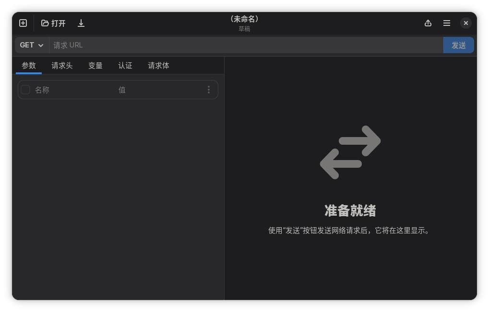
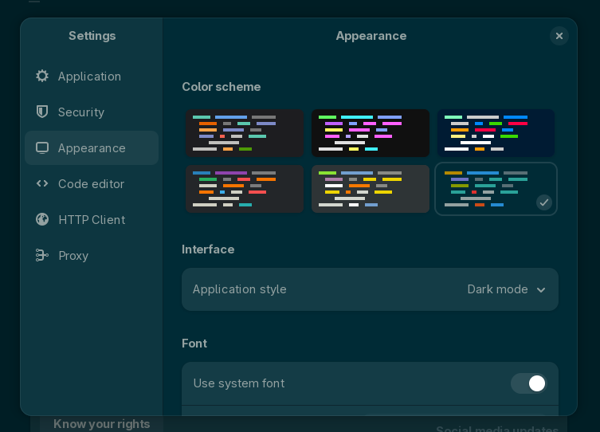
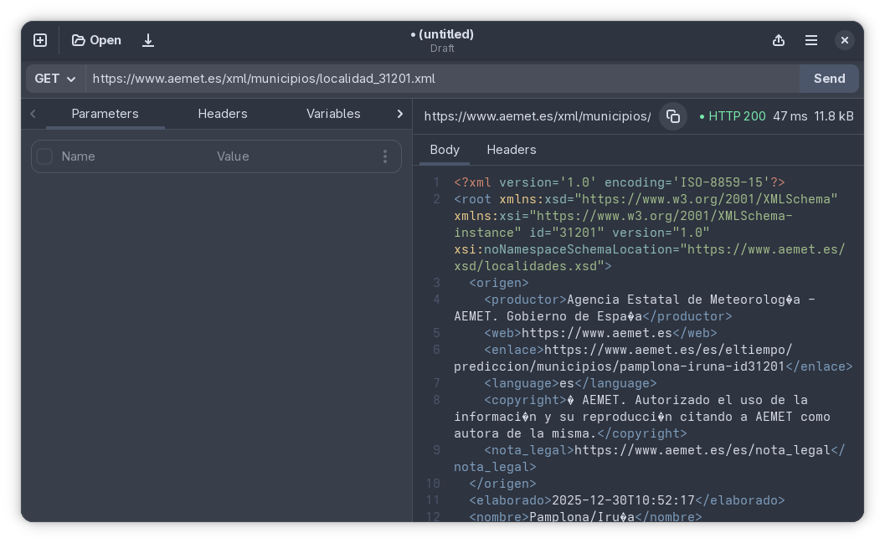
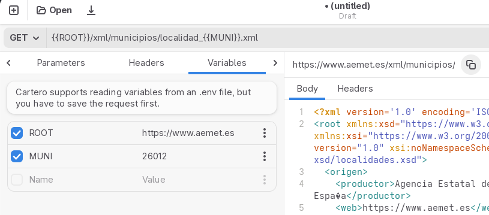
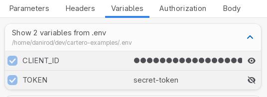
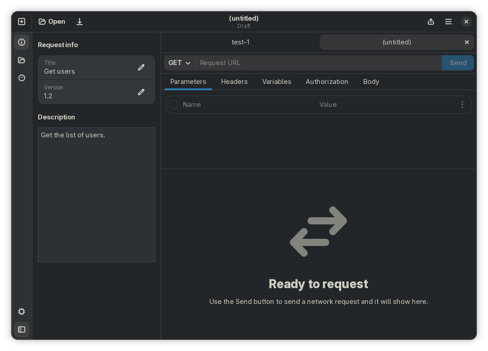

Time for the last release of the year. Not much to offer, but I wanted to make
available some of the fixes that have recently been addressed in Cartero.

Plus, Cartero is now available in Simplified Chinese! This translation landed
days after releasing 25.0 so it has been waiting for some time. I am sorry for
the delay!

<figure>

</figure>

Thank you to @CloneWith, who provided the translations through our
[Weblate](https://hosted.weblate.org/projects/cartero/cartero/) project.
Just like the rest of the contributors who have also provided translations
in other languages in this iteration: Indonesian, Basque and Brazilian
Portuguese.

## Color themes

Cartero 25.1 introduces initial support for color themes.

You can use the appearance settings to customize the color scheme in use by
the request and response body editors. However, my favourite feature is that
the whole user interface will tint now in the style of the color scheme in
use, which is fancy.

Cartero 25.1 ships with the default colorschemes provided by GtkSourceView:
Adwaita, Solarized, Kate, Cobalt and Tango/Oblivion.

<figure>

</figure>

However, eventually more color schemes will be available in future releases.
I know it's possible, because I have tested to sideload the XML styles from
GNOME Builder and the result has been successful. But I'd like to find other
solutions that are not just copying files from other projects, like writing my
own XML generator.

<figure>

</figure>

## Effective URL for a response

As a QoL change, when you make a request, it is now possible to see the actual
URL that has been requested. This is good because if you have variables in the
URL, like the API root or some path param, reading the request URL can be a
challenge sometimes. Now you can see the unmangled URL above the response.

If your original request results in some redirections being made, the effective
URL will also reflect the final URL after following the redirections, which
is useful.

<figure>

</figure>

## Concealing and revealing env variables

Cartero 25.0 added support for .env files. You can use this feature to keep
secrets out of your collections, or to share variables between your main
application and the collection files. But previously, Cartero only showed the
names of the .env variables, not the values. The values were always hidden.

In Cartero 25.1, the values for the .env variables will continue to be hidden
by default, for privacy, but if you press the eye button, you will be able
to reveal and conceal the value for that variable.

<figure>

</figure>

## Duplicating requests

Another painpoint that I found at work a long time ago is that when you are
working on an API, you usually have multiple endpoints, and having to create
new files from scratch and copying some things from one file to another can
be tiresome.

In Cartero 25.1, there is a new menu option that you can use to **duplicate**
a request. When you duplicate a request, a new untitled tab is opened, just
like when you press the **New** button. However, the data from the tab you
duplicated gets also transfered to the new one. **It's like using the _Save as_
menu, but on a separate tab.**

## shell-ng status

I am still working on the new shell. This will be discussed in a deeper
technical post, but I am starting to understand why most Electron apps do not
support more than one window. Making sure that the state of each window does
not conflict is a challenge!

I am working on an action bar too. It will pair perfectly with the new shell
to provide services like collections (you have to believe!) or a folder
explorer, but it will also provide other stuff like a request history, and
eventually stuff like a cookie jar or an environment manager. Here is a
prototype on how it could look (this is **not finished**):

<figure>

</figure>

## Happy new year!

Hoping the next year brings all the best.
